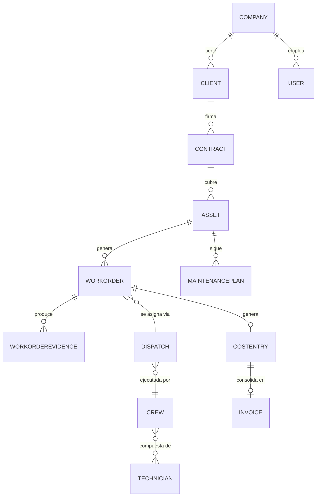

# 03-Domain-Model

> Lenguaje ubicuo (Ubiquitous Language) compartido entre negocio y técnica: bounded contexts, entidades core y sus relaciones, antes de tocar base de datos o código.

**Estado:** `Draft v0.1`
**Depende de:** `01-Product/README.md`
**De este documento dependen:** `04-Architecture/`, `05-Database/`, `06-Modules/*`, `16-Glossary/`

---

## Purpose

Fijar el lenguaje ubicuo y los bounded contexts de FIELDOPS para que
Arquitectura, Base de Datos y cada Módulo hablen de las mismas entidades con
el mismo significado. Este documento se escribe antes de cualquier tabla o
endpoint — es el contrato conceptual del sistema.

## Responsibilities

Cubre: bounded contexts, entidades core por contexto, relaciones entre
ellas y eventos de dominio principales. **No cubre**: esquema físico de
base de datos (→ `05-Database/`), contratos de API (→ `08-Backend/`), ni
reglas de negocio detalladas por pantalla (→ `06-Modules/*`).

## Scope

Todo el dominio de negocio de FIELDOPS: activos, mantenimiento, órdenes de
trabajo, clientes, logística, personas de campo, finanzas operativas y
configuración multiempresa. BI queda fuera como bounded context propio (es
un modelo de lectura sobre los demás, ver Open Questions).

## Functional Description

### Bounded contexts (mapeo 1:1 con módulos de negocio)

| Bounded Context | Módulo | Responsabilidad conceptual |
|---|---|---|
| **Identity & Tenancy** | Configuración | Quién es la empresa, quién es el usuario, qué puede hacer |
| **CRM** | CRM | Con quién tenemos relación comercial y bajo qué contrato |
| **Asset & Maintenance** | Operaciones | Qué activos existen y qué mantenimiento requieren |
| **Work Order** | Operaciones | Qué trabajo se ejecuta, cuándo y con qué evidencia |
| **Dispatch & Inventory** | Logística | Quién y con qué repuesto se ejecuta el trabajo |
| **Workforce** | RRHH | Quién puede trabajar, cuándo y con qué competencia |
| **Billing** | Finanzas | Qué se cobra y qué cuesta cada trabajo |

`Asset & Maintenance` y `Work Order` viven ambos bajo el módulo Operaciones
pero son bounded contexts separados a propósito: un activo existe
independientemente de si tiene una OT abierta.

### Entidades core por contexto

- **Identity & Tenancy:** `Company` (tenant), `User`, `Role`, `Permission`,
  `FeatureFlag`.
- **CRM:** `Client`, `Contract`, `Opportunity`.
- **Asset & Maintenance:** `Asset`, `MaintenancePlan`, `Checklist`.
- **Work Order:** `WorkOrder`, `WorkOrderEvidence`, `WorkOrderStatus`.
- **Dispatch & Inventory:** `Crew`, `Dispatch`, `InventoryItem`, `Warehouse`,
  `Route`.
- **Workforce:** `Technician`, `Shift`, `Skill`, `Attendance`.
- **Billing:** `Invoice`, `CostEntry`, `Payment`, `AccountReceivable`.

### Relaciones core (modelo conceptual, no físico)

Este diagrama es conceptual — cardinalidades exactas, claves foráneas e
índices se cierran en `05-Database/`.

## Business Rules

Invariantes de dominio (no reglas de UI ni de negocio comercial):

1. Un `Asset` pertenece exactamente a un `Client` y a un `Company` (tenant) —
   nunca a dos empresas a la vez, ni queda huérfano.
2. Un `WorkOrder` siempre referencia exactamente un `Asset` — no existe OT
   "genérica" sin activo asociado.
3. Un `WorkOrder` no puede cerrarse (`WorkOrderStatus = Closed`) sin al
   menos una `WorkOrderEvidence` asociada (regla de producto #4 heredada).
4. Un `Dispatch` asigna un `WorkOrder` a exactamente un `Crew` activo en el
   momento de la asignación.
5. Un `CostEntry` se genera al cerrar un `WorkOrder`, antes de consolidarse
   en un `Invoice` — el costo existe aunque la factura aún no se emita.

## Data Model

Esta es la sección central de este documento — ver "Entidades core" y el
diagrama conceptual arriba. El modelo físico completo (tipos, índices,
constraints, particionamiento para 50M de OT) se documenta en
`05-Database/`, derivado 1:1 de estas entidades sin agregar conceptos
nuevos que no estén nombrados aquí.

## UX

N/A — el modelo de dominio no tiene pantallas propias. Cada entidad se
expone en la UX de su módulo correspondiente en `06-Modules/*` y `14-UX/`.

## Security

`Company` es el límite de aislamiento (tenant boundary): toda entidad core
lleva `company_id` de forma directa o transitiva (vía `Asset`, `Client`,
etc.) — ninguna consulta cruza ese límite sin pasar por RBAC (detalle en
`13-Security/`).

## API

N/A — vive en `08-Backend/`, derivado de estos bounded contexts (cada uno
tiende a mapear a un servicio/módulo de API).

## Events

Eventos de dominio principales (nombres definitivos, usar tal cual en todo
el sistema): `AssetCreated`, `MaintenancePlanTriggered`, `WorkOrderCreated`,
`WorkOrderDispatched`, `WorkOrderClosed`, `CostEntryGenerated`,
`InvoiceIssued`. Detalle de payload y consumidores en `04-Architecture/`
(patrón Outbox) y cada módulo en `06-Modules/*`.

## Dependencies

Depende de `01-Product/README.md` (las entidades nacen de los casos de uso
ahí descritos). De este documento dependen directamente `05-Database/`
(esquema físico), `04-Architecture/` (límites de servicio) y todo
`06-Modules/*` (cada módulo detalla su bounded context sin inventar
entidades nuevas fuera de este glosario).

## Future Improvements

- Bounded context propio para telemetría IoT de activos (sensores) cuando
  se aborde `11-Integrations/` en esa dirección.
- Evaluar si `Workforce` debe separarse de RRHH-administrativo (nómina)
  versus RRHH-operativo (disponibilidad para OT) a medida que crezca.

## Open Questions

1. ¿BI es un bounded context propio (con sus propias entidades agregadas)
   o puramente un modelo de lectura (read-model/CQRS) sobre los demás
   contextos? Definir en `04-Architecture/` antes de `06-Modules/06-BI/`.
2. ¿`Identity & Tenancy` (Configuración) se trata como bounded context de
   negocio o como infraestructura transversal? Afecta cómo se documenta en
   `06-Modules/07-Configuracion/`.
3. ¿`Contract` (CRM) puede cubrir activos de múltiples ubicaciones/sitios
   de un mismo cliente, o es 1:1 contrato-sitio? Afecta el modelo de
   `05-Database/`.
