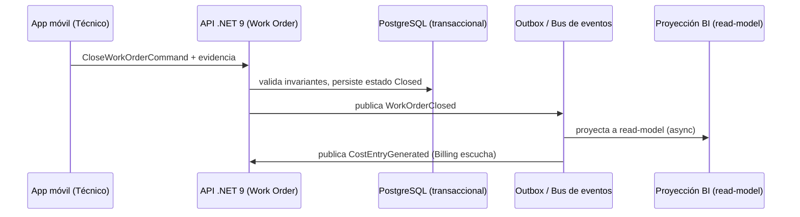
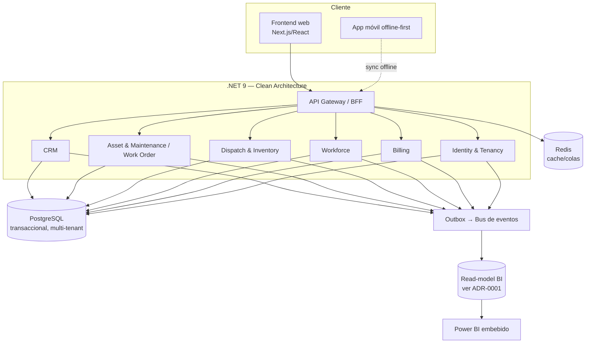

# 04-Architecture

> Arquitectura técnica global: capas, patrones (Clean/Hexagonal, CQRS, DDD), diagramas de componentes y de despliegue, y las decisiones de stack.

**Estado:** `Draft v0.1`
**Depende de:** `03-Domain-Model/README.md`, `ADR-0001`, `ADR-0002`
**De este documento dependen:** `05-Database/`, `07-Frontend/`, `08-Backend/`, `09-Mobile/`, `12-Infrastructure/`

---

## Purpose

Traducir los bounded contexts de `03-Domain-Model/` y el stack fijado en
`MASTER.md`/ADRs en una arquitectura concreta: capas, límites de servicio,
cómo fluye un comando y cómo se proyecta un read-model, antes de escribir
código o esquema de base de datos.

## Responsibilities

Cubre: estilo arquitectónico, capas y sus responsabilidades, cómo se
implementan CQRS/Outbox/DDD en la práctica, diagrama de componentes y de
despliegue de alto nivel. **No cubre**: esquema de tablas (→
`05-Database/`), estructura de carpetas de frontend/backend en detalle (→
`07-Frontend/`, `08-Backend/`), ni pipeline de CI/CD (→ `12-Infrastructure/`).

## Scope

Arquitectura del backend transaccional, del mecanismo de proyección hacia
BI y de la relación entre backend, frontend web y app móvil offline. No
cubre topología de infraestructura cloud específica (proveedor, regiones) —
eso es `12-Infrastructure/`.

## Functional Description

### Estilo arquitectónico

**Clean Architecture / Hexagonal por bounded context**, con **CQRS**
transversal (`MASTER.md §3`, confirmado por ADR-0001 para BI). Cada bounded
context de `03-Domain-Model/` (Identity & Tenancy, CRM, Asset & Maintenance,
Work Order, Dispatch & Inventory, Workforce, Billing) es un módulo con sus
propias capas:

```
Dominio        → Entidades, Value Objects, invariantes (§ "Business Rules" de 03-Domain-Model)
Aplicación     → Comandos, Queries, Handlers (CQRS), Specification
Infraestructura→ Repository (persistencia), Outbox, integraciones externas
API            → Controllers REST + OpenAPI, autenticación/autorización
```

Ningún módulo llama a la base de datos de otro directamente — se comunica
vía eventos de dominio (Outbox) o vía su API, nunca compartiendo tablas.

### Flujo de comando → evento → read-model (ejemplo: cerrar una OT)



Este flujo es el mecanismo estándar para todo comando que cruce bounded
contexts — no hay llamadas síncronas entre módulos de negocio salvo
consultas de solo lectura vía API pública del otro módulo.

### Diagrama de componentes (alto nivel)



## Business Rules

Reglas arquitectónicas (heredadas y concretadas de `MASTER.md §3`):

1. Todo comando que cambia estado pasa por un Handler de Aplicación — nunca
   se escribe a la base de datos directo desde un Controller.
2. Todo cambio de estado relevante para otro bounded context se publica
   como evento de dominio vía Outbox — nunca se invoca síncronamente la
   base de datos de otro módulo.
3. BI nunca lee de la base transaccional directamente (ADR-0001) — siempre
   vía su read-model proyectado.
4. Todo endpoint autenticado valida `tenant_id` (Company) antes de
   cualquier lógica de negocio — el aislamiento multiempresa se hace en un
   middleware transversal, no repetido por módulo.
5. La app móvil nunca bloquea una acción del técnico por falta de red — las
   operaciones se encolan localmente y se sincronizan vía Outbox al
   reconectar (detalle en `09-Mobile/`).

## Data Model

N/A en detalle — vive en `05-Database/`, derivado de las entidades de
`03-Domain-Model/`. Este documento solo fija que existen dos almacenes
lógicos: transaccional (por bounded context, mismo PostgreSQL) y read-model
de BI (separado, ADR-0001).

## UX

N/A — vive en `07-Frontend/`, `09-Mobile/` y `14-UX/`.

## Security

Autenticación JWT + OAuth2, autorización RBAC en middleware transversal
(regla #4 arriba). Detalle completo de roles, permisos y cumplimiento en
`13-Security/`.

## API

Contrato REST + OpenAPI por bounded context, expuesto a través de un API
Gateway/BFF único que consume el frontend web y la app móvil. Detalle de
endpoints por módulo en `08-Backend/` y en cada `06-Modules/*`.

## Events

Bus de eventos alimentado por el patrón Outbox en cada módulo. Eventos
core ya nombrados en `03-Domain-Model/README.md` (`WorkOrderClosed`,
`InvoiceIssued`, etc.) — este documento no redefine nombres, solo el
mecanismo de transporte.

## Dependencies

Depende de `03-Domain-Model/README.md` (bounded contexts) y de ADR-0001 /
ADR-0002 (decisiones de stack ya tomadas). De este documento dependen
directamente `05-Database/`, `07-Frontend/`, `08-Backend/`, `09-Mobile/` y
`12-Infrastructure/` — ninguno de ellos debe introducir un patrón
arquitectónico no descrito aquí sin un nuevo ADR.

## Future Improvements

- Evaluar extracción de bounded contexts a servicios desplegables de forma
  independiente (hoy se documentan como módulos de un mismo backend .NET,
  no necesariamente microservicios separados desde el día 1).
- Definir estrategia de particionamiento/sharding de PostgreSQL cuando
  `05-Database/` aborde el volumen de 50M de OT en detalle.

## Open Questions

1. ¿El backend se despliega como monolito modular (un solo servicio .NET
   con los bounded contexts como módulos internos) o como servicios
   separados desde el lanzamiento? — **Resuelto en `08-Backend/README.md`:
   monolito modular.**
2. **Resuelto:** el read-model de BI (ADR-0001) vive en el **mismo
   clúster PostgreSQL, schema separado** (ver `05-Database/README.md`).
3. ¿Qué bus de eventos concreto implementa el Outbox? — **Resuelto en
   `08-Backend/README.md`: PostgreSQL Outbox + relay a Redis Streams.**
